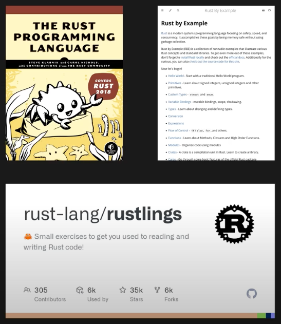
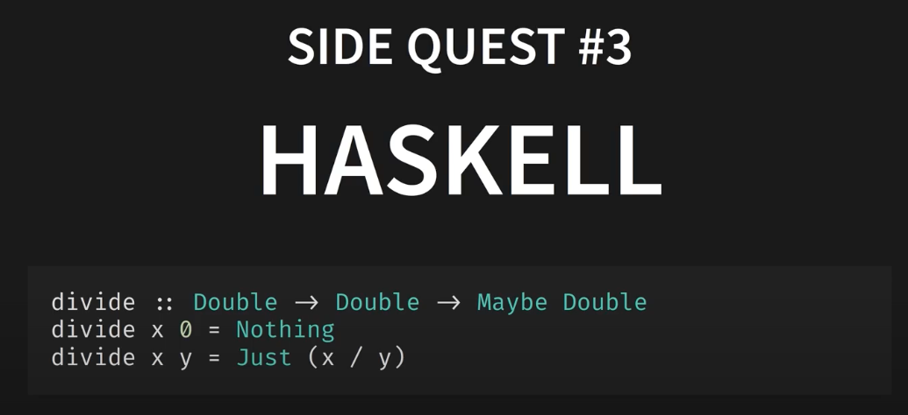
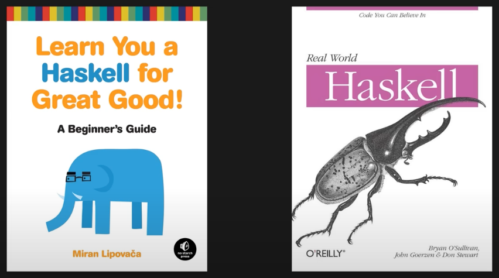
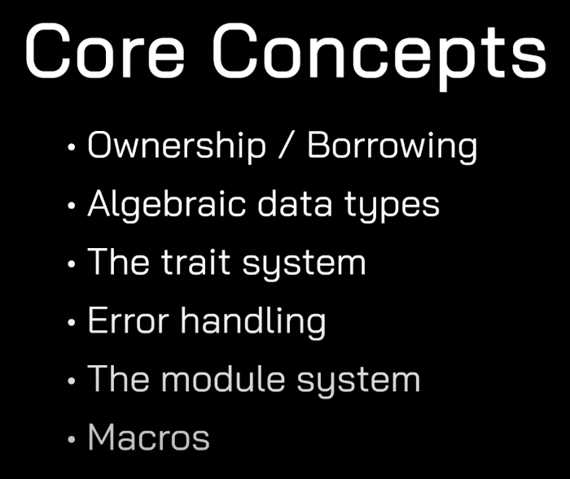

# Rust

### How to learn Rust

No Boilerplate > https://youtu.be/2hXNd6x9sZs?si=F7k9ERmgH-MRNq0h

<br/>

- The Rust Book > https://doc.rust-lang.org/book/
- Rust by Example > https://rustbyexample.io/ or https://doc.rust-lang.org/stable/rust-by-example/
- Rustlings > http://rustlings.cool/ 

<br/>

<br/>

- https://learnyouahaskell.com
- https://i.iinfo.cz/files/root/k/real-world-haskell.pdf

### Rust Courses

Rust Crash Course | Rustlang via Traversy Media
- https://www.youtube.com/watch?v=zF34dRivLOw

Building a Rust App with Yew! via Let's Get Rusty
- https://www.youtube.com/watch?v=KmOeFrwz8BM

Learn Rust Programming - Complete Course 🦀
- https://youtu.be/BpPEoZW5IiY

### Other Rust content YT channels

No Boilerplate - Rust for the impatient > https://youtu.be/br3GIIQeefY?si=gctO03OJLoww24JH<br/>
Let's get Rusty - All Rust features explained > https://youtu.be/784JWR4oxOI?si=jSpk1ZTIsRa6m9Vq<br/>
The Dev Method - Rust: Intro and setting up your first project > https://youtu.be/pGh-0cMvH5g?si=tFknUYh0r8udO1NG<br/>
Rust Crash Course Tutorial for Solana > https://youtu.be/-AAtfPHEMbA?si=LCheuHsEm-Zng-uQ<br/>

### Online Documentation Links
- https://doc.rust-lang.org/
- https://github.com/rust-lang/rustlings/
- https://77.131.55.43/files/hyperreal/alex/rust/Rust%20for%20Rustaceans_%20Idiomatic%20Programming%20-%20Jon%20Gjengset.pdf
- https://play.rust-lang.org/?version=stable&mode=debug&edition=2021
- https://www.youtube.com/channel/UCaYhcUwRBNscFNUKTjgPFiA

### Rust Playground and Practice Stuff

- https://play.rust-lang.org/
- http://practice.course.rs/variables.html

### Install Rust and Cargo
- https://doc.rust-lang.org/cargo/getting-started/installation.html

### IDE & Setup Stuff - VSCODE

- https://youtu.be/BU1LYFkpJuk - 5 Better ways to code in Rust (Let's get Rusty)
  - https://blessed.rs/crates
  - https://crates.io

#### Commands for Rust App with Yew!
```
rustc --version
rustup target add wasm32-unknown-unknown
cargo install trunk
# Output : Installed package `trunk v0.16.0` (executable `trunk`)
To start the app run :
trunk serve
# Then goto localhost:8080
```
</br>
Rust Fundamentals | PluralSight
- https://www.pluralsight.com/courses/rust-fundamentals

### Rust-lang.org Setup
https://www.rust-lang.org/learn/get-started
```
- curl --proto '=https' --tlsv1.2 -sSf https://sh.rustup.rs | sh
# 'option 1'
```
Then restart the terminal</br></br>

### Main Commands and Rust Language</br></br>
```
rustup --version
rustup update
rustc --version
cargo --version

mkdir rust_sandbox
cargo init

cargo check

cargo build
cargo build --release

cargo run
```

### Core Concepts
<br/>

### Variables
Variables hold primitive data or references to data</br>
Variables are immutable by default</br>
Rust is a block-scoped language</br></br>

### Data Types
Primitive Types--</br>
Integers: u8, i8, u16, i16, u32, i32, u64, i64, u128, i128 (number of bits they take in memory)</br>
Floats: f32, f64</br>
Boolean (bool)</br>
Characters (char)</br>
Tuples</br>
Arrays</br></br>

An unsigned number (u32) contains just zero or positive values, whereas a signed number (i32)<br/> 
has both positive and negative numbers along with the value zero.</br></br>

<br/>

Rust is a statically typed language, which means that it must know the types of all</br>
variables at compile time. However, the compiler can usually infer what type we want to</br>
use based on the value and  how we use it.</br></br>

### Strings
Primitive str = Immutable fixed-length string somewhere in memory</br>
String = Growable, heap-allocated data structure - Use when you need to modify or own string data</br></br>

### Tuples
Tuples group together values of different types</br>
Max 12 elements</br></br>

### Arrays
Arrays - Fixed list where elements are the same data types</br></br>

### Vectors
Vectors - Resizable arrays</br></br>

### Conditionals
Conditionals - used to check the condition of something and act on the result</br></br>

### Loops
Loops - used to iterate until a condition is met</br></br>

### Functions
Functions - used to store block of code for re-use</br></br>

### Reference Pointers
Reference Pointers - Point to a resource in memory</br></br>

With non-primitives, if you assign another variable to a piece of data, the first</br>
variable will no longer hold that value.  You'll need to use a reference (&) to</br>
point to the resource...</br></br>

### Structs
Structs - used to create custom data types</br></br>

### Enums
Enums are types which have a few definite values</br></br>

### Command Line Args
See the file "cli.rs"</br></br></br>
