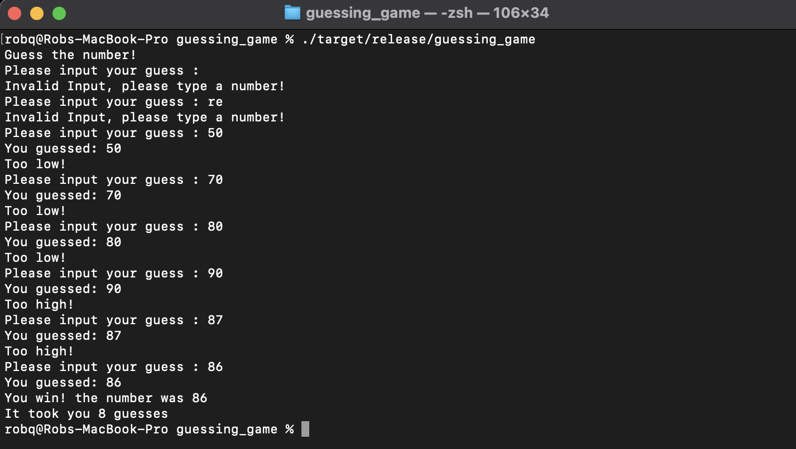

# The Rust Programming Languge

https://doc.rust-lang.org/book/title-page.html

## 1. Getting started

### Information
By default, Rust has a set of items defined in the standard library that it brings into the scope of every program. This set is called the prelude, and you can see everything in it [in the standard library documentation](https://doc.rust-lang.org/std/prelude/index.html).

### Install Rust and Cargo
- https://doc.rust-lang.org/cargo/getting-started/installation.html

### Main Commands</br>
- Install Rust and Cargo
  - https://doc.rust-lang.org/cargo/getting-started/installation.html<br/><br/>

- Creating a New Package
```
cargo new hello_world --bin
```
<span style="color:darkgreen;">
We’re passing --bin because we’re making a binary program: if we were making a library, we’d pass --lib. This also initializes a new git repository by default. If you don’t want it to do that, pass --vcs none. i.e.
```
</span></br></br>
cargo new hello_world --lib --vcs
```

- Build and Compile using :
```
cd hello_world
cargo build
```

- Then run the program using :
```
./target/debug/hello_world
```
- or
```
cargo run
```
- Once your ready to release use :
```
cargo build --release
   Compiling hello_world v0.1.0 (/Users/robq/workspace/rust/cargo/hello_world)
    Finished release [optimized] target(s) in 0.76s
```
- then :
```
./target/release/hello_world
# output
# Hello, world!
```
<span style="color:darkgreen;">
Compiling in debug mode is the default for development. Compilation time is shorter since the compiler doesn’t do optimizations, but the code will run slower. Release mode takes longer to compile, but the code will run faster.
</span></br></br>

You can build a project without producing a binary to check for errors using :
```
cargo check
```

## 2. Programming a Guessing Game

https://doc.rust-lang.org/book/ch02-00-guessing-game-tutorial.html

### Notes

From Programming the Guessing Game (Specically regarding Line 19): <br/>
```
let guess: u32 = guess.trim().parse().expect("Please type a number!");
```
  We create a variable named guess. But wait, doesn’t the program already have a variable named<br/> 
  guess? It does, but helpfully Rust allows us to shadow the previous value of guess with a new one.<br/> 
  Shadowing lets us reuse the guess variable name rather than forcing us to create two unique variables,<br/> 
  such as guess_str and guess, for example. We’ll cover this in more detail in Chapter 3, but for now,<br/> 
  know that this feature is often used when you want to convert a value from one type to another type.<br/>

An unsigned number (u32) contains just zero or positive values, whereas a signed number (i32)<br/> 
has both positive and negative numbers along with the value zero.</br></br>

<br/>

In many cases you could use i32 for everything!
  
### The Guessing Game Final Release

https://github.com/Quackers71/rust/blob/main/rust-lang.org/guessing_game/src/main.rs

```
./target/release/guessing_game
```
<br/>

## 3. Common Programming Concepts

https://doc.rust-lang.org/book/ch03-00-common-programming-concepts.html

Keywords - https://doc.rust-lang.org/book/appendix-01-keywords.html

Here’s an example of a constant declaration:
```
const THREE_HOURS_IN_SECONDS: u32 = 60 * 60 * 3;
```
Constant Evaluation - https://doc.rust-lang.org/reference/const_eval.html

### Scalar Types

A scalar type represents a single value. Rust has four primary scalar types: integers, floating-point<br/> 
numbers, Booleans, and characters. You may recognize these from other programming languages.<br/>  

Appendix B: Operators and Symbols - https://doc.rust-lang.org/book/appendix-02-operators.html
