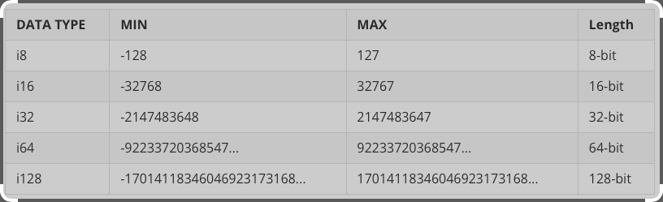
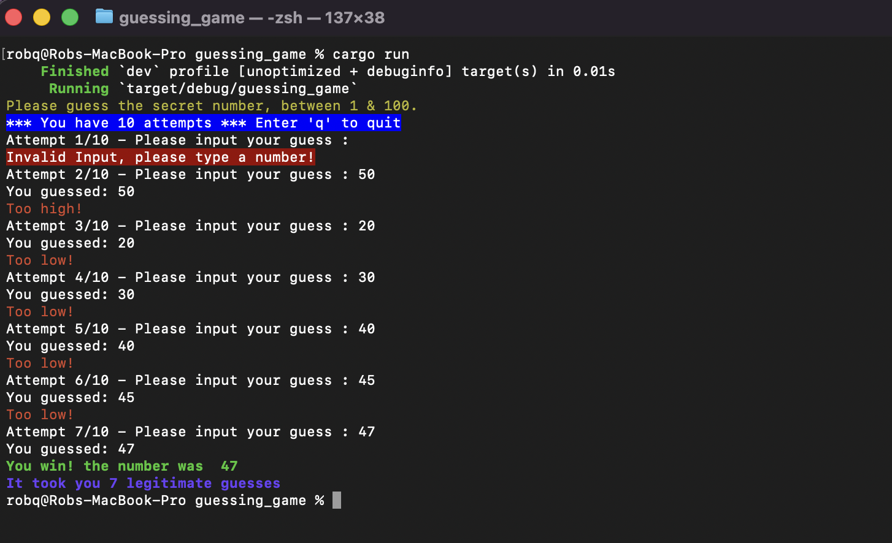

# The Rust Programming Languge

https://doc.rust-lang.org/book/title-page.html

## 1. Getting started

### Information
By default, Rust has a set of items defined in the standard library that it brings into the scope of every program. This set is called the prelude, and you can see everything in it [in the standard library documentation](https://doc.rust-lang.org/std/prelude/index.html).

### Install Rust and Cargo
- https://doc.rust-lang.org/cargo/getting-started/installation.html

### Main Commands</br>
- Install Rust and Cargo
  - https://doc.rust-lang.org/cargo/getting-started/installation.html<br/><br/>

- Creating a New Package
```
cargo new hello_world --bin
```
<span style="color:darkgreen;">
We’re passing --bin because we’re making a binary program: if we were making a library, we’d pass --lib. This also initializes a new git repository by default. If you don’t want it to do that, pass --vcs none. i.e.
```
</span></br></br>
cargo new hello_world --lib --vcs
```

- Build and Compile using :
```
cd hello_world
cargo build
```

- Then run the program using :
```
./target/debug/hello_world
```
- or
```
cargo run
```
- Once your ready to release use :
```
cargo build --release
   Compiling hello_world v0.1.0 (/Users/robq/workspace/rust/cargo/hello_world)
    Finished release [optimized] target(s) in 0.76s
```
- then :
```
./target/release/hello_world
# output
# Hello, world!
```
<span style="color:darkgreen;">
Compiling in debug mode is the default for development. Compilation time is shorter since the compiler doesn’t do optimizations, but the code will run slower. Release mode takes longer to compile, but the code will run faster.
</span></br></br>

You can build a project without producing a binary to check for errors using :
```
cargo check
```

## 2. Programming a Guessing Game

https://doc.rust-lang.org/book/ch02-00-guessing-game-tutorial.html

### Notes

From Programming the Guessing Game (Specically regarding Line 19): <br/>
```
let guess: u32 = guess.trim().parse().expect("Please type a number!");
```
  We create a variable named guess. But wait, doesn’t the program already have a variable named<br/> 
  guess? It does, but helpfully Rust allows us to shadow the previous value of guess with a new one.<br/> 
  Shadowing lets us reuse the guess variable name rather than forcing us to create two unique variables,<br/> 
  such as guess_str and guess, for example. We’ll cover this in more detail in Chapter 3, but for now,<br/> 
  know that this feature is often used when you want to convert a value from one type to another type.<br/>

An unsigned number (u32) contains just zero or positive values, whereas a signed number (i32)<br/> 
has both positive and negative numbers along with the value zero.</br></br>

<br/>

In many cases you could use i32 for everything!
  
### The Guessing Game Final Release

https://github.com/Quackers71/rust/blob/main/rust-lang.org/guessing_game/src/main.rs

```
./target/release/guessing_game
or
cargo run
```
<br/>

## 3. Common Programming Concepts

https://doc.rust-lang.org/book/ch03-00-common-programming-concepts.html

Keywords - https://doc.rust-lang.org/book/appendix-01-keywords.html

Here’s an example of a constant declaration:
```
const THREE_HOURS_IN_SECONDS: u32 = 60 * 60 * 3;
```
Constant Evaluation - https://doc.rust-lang.org/reference/const_eval.html

### Scalar Types

- A scalar type represents a single value. Rust has four primary scalar types: integers, floating-point<br/> 
numbers, Booleans, and characters. You may recognize these from other programming languages.<br/>  

Appendix B: Operators and Symbols - https://doc.rust-lang.org/book/appendix-02-operators.html

### Compound Types

Compound types can group multiple values into one type. Rust has two primitive compound types:<br/>
tuples and arrays.<br/>

- The Tuple Type - A tuple is a general way of grouping together a number of values with a variety<br/>
of types into one compound type. Tuples have a fixed length: once declared, they cannot grow or<br/>
shrink in size.<br/>

- The Array Type - Another way to have a collection of multiple values is with an array. Unlike a<br/>
tuple, every element of an array must have the same type. Unlike arrays in some other languages,<br/>
arrays in Rust have a fixed length.<br/>

### Functions

Functions are prevalent in Rust code. You’ve already seen one of the most important functions in<br/>
the language: the main function, which is the entry point of many programs. You’ve also seen the<br/> 
fn keyword, which allows you to declare new functions.<br/>

- Parameters and Arguments

We can define functions to have parameters, which are special variables that are part of a function’s<br/> 
signature. When a function has parameters, you can provide it with concrete values for those parameters.<br/> 
Technically,the concrete values are called arguments, but in casual conversation, people tend to use the<br/> 
words parameter and argument interchangeably for either the variables in a function’s definition or the<br/> 
concrete values passed in when you call a function.<br/>

- Statements and Expressions

Function bodies are made up of a series of statements optionally ending in an expression. So far, the<br/> 
functions we’ve covered haven’t included an ending expression, but you have seen an expression as part<br/>
of a statement. Because Rust is an expression-based language, this is an important distinction to understand.<br/>
Other languages don’t have the same distinctions, so let’s look at what statements and expressions are and<br/> 
how their differences affect the bodies of functions.<br/>

    - Statements are instructions that perform some action and do not return a value.
    - Expressions evaluate to a resultant value.<br/>

- Functions with Return Values

Functions can return values to the code that calls them. We don’t name return values, but we must declare<br/> 
their type after an arrow (->). In Rust, the return value of the function is synonymous with the value of<br/> 
the final expression in the block of the body of a function. You can return early from a function by using<br/> 
the return keyword and specifying a value, but most functions return the last expression implicitly.<br/>

### Control Flow

The ability to run some code depending on whether a condition is true and to run some code repeatedly while<br/> 
a condition is true are basic building blocks in most programming languages. The most common constructs that<br/>
let you control the flow of execution of Rust code are if expressions and loops.<br/>

- if Expressions 

An if expression allows you to branch your code depending on conditions. You provide a condition and then<br/> 
state, “If this condition is met, run this block of code. If the condition is not met, do not run this block<br/> 
of code.”<br/>

- Handling Multiple Conditions with else if
- Using if in a let Statement
- Repetition with Loops - loop, while and for.
- Repeating Code with loop
- Returning Values from Loops
- Loop Labels to Disambiguate Between Multiple Loops

If you have loops within loops, break and continue apply to the innermost loop at that point. You can optionally<br/> 
specify a loop label on a loop that you can then use with break or continue to specify that those keywords apply<br/> 
to the labeled loop instead of the innermost loop. Loop labels must begin with a single quote.<br/>

- Conditional Loops with while
- Looping Through a Collection with for
- more concise using 'for in' and using .rev() - reverse

### Summary

You learned about variables, scalar and compound data types, functions, comments, if expressions, and loops!<br/> 
To practice with the concepts discussed in this chapter, try building programs to do the following:<br/>

- Convert temperatures between Fahrenheit and Celsius.
- Generate the nth Fibonacci number.
- Print the lyrics to the Christmas carol “The Twelve Days of Christmas,” taking advantage of the repetition in the song.

## 4. Understanding Ownership

Ownership is a set of rules that govern how a Rust program manages memory. All programs have to manage the way they<br/>
use a computer’s memory while running. Some languages have garbage collection that regularly looks for no-longer-used<br/> memory as the program runs; in other languages, the programmer must explicitly allocate and free the memory. Rust uses<br/>
a third approach: memory is managed through a system of ownership with a set of rules that the compiler checks. If any<br/>
of the rules are violated, the program won’t compile. None of the features of ownership will slow down your program<br/>
while it’s running.<br/>

### Ownership Rules

- Each value in Rust has a variable that's called its owner.
- There can only be one owner at a time.
- When the owner goes out of scope, the value will be dropped.

### The Stack and the Heap

Both the stack and the heap are parts of memory available to your code to use at runtime, but they are structured in<br> different ways.<br/>

- The stack stores values in the order it gets them and removes the values in the opposite order.

- The Heap is less organized: when you put data on the heap, you request a certain amount of space.

### Variable Scope - String Literal

String Literal - The variable s refers to a string literal, where the value of the string is hardcoded into the<br/> 
text of our program. The variable is valid from the point at which it’s declared until the end of the current scope.<br/>

```
let s = "hello";
```

### The String Type

Rust has a second string type, String. This type manages data allocated on the heap and as such is able to store<br/> 
an amount of text that is unknown to us at compile time. You can create a String from a string literal using the<br/> 
from function, like so:<br/>
```
let s = String::from("Hello");
```
The double colon :: operator allows us to namespace this particular from function under the String type rather<br/> 
than using some sort of name like string_from.<br/>

This kind of string can be mutated:
```
let mut s = String::from("Hello");

s.push_str(" World!"); // push_str() appends a literal to a String

println!("{}", s); // This will print `Hello World!`
```
So, what’s the difference here? Why can String be mutated but literals cannot? The difference is in how these<br/> 
two types deal with memory.<br/>

### Memory and Allocation

In the case of a string literal, we know the contents at compile time, so the text is hardcoded directly into the<br/> 
final executable. This is why string literals are fast and efficient. But these properties only come from the string<br/> literal’s immutability. Unfortunately, we can’t put a blob of memory into the binary for each piece of text whose<br/> 
size is unknown at compile time and whose size might change while running the program.<br/>

Rust takes a different path: the memory is automatically returned once the variable that owns it goes out of scope.<br/>
