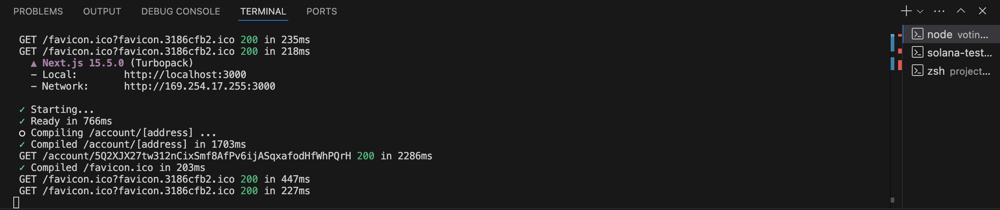
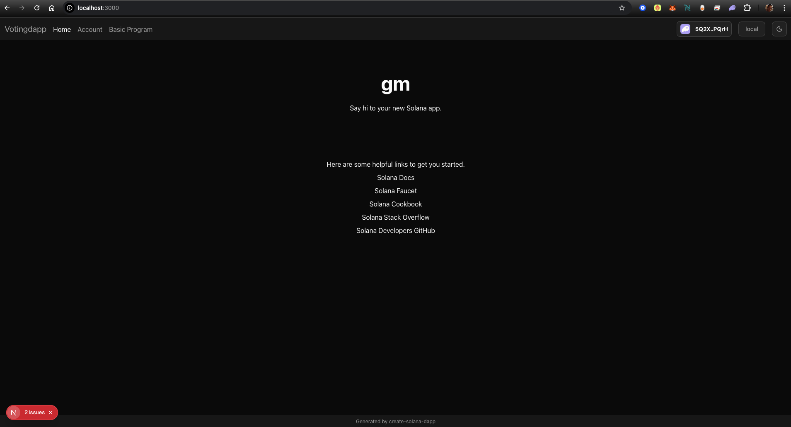
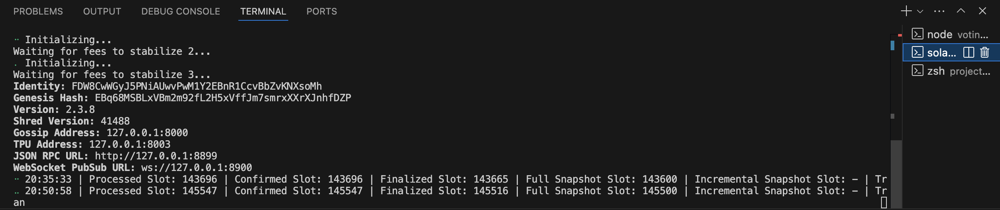
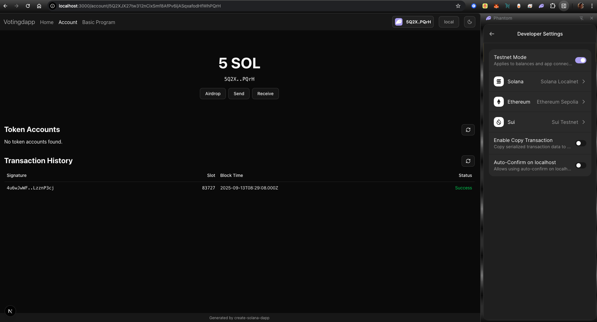
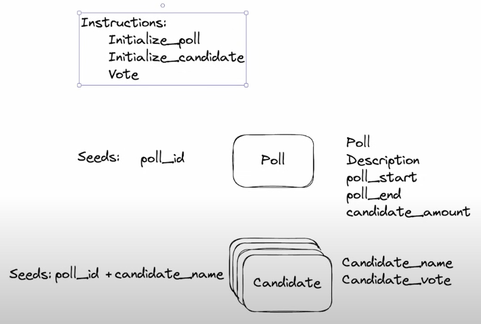

## Solana Developer Bootcamp 2024 - Project 2

- Project 1 | Building a Voting Program

- Setup commands
```
mkdir project-2-voting
cd project-2-voting
npx create-solana-dapp
cd voting-dapp
```
- Start the NodeJS dapp
```
npm run dev
```
<br/><br/>

- Votingdapp Homepage UI via http://localhost:3000<br/>
<br/><br/>

- Solana Test Validator (validated via http://127.0.0.1:8899)
```
solana-test-validator
```
<br/><br/>

- Install the Phantom wallet & setup a new account
- Change the configuration to Solana > Developer Settings > Solana Localnet

- Votingdapp Account UI via http://localhost:3000/account/5Q2XJX27tw312nCixSmf8AfPv6ijASqxafodHfWhPQrH<br/>
<br/><br/>

- Voting Dapp Structure
<br/><br/>

- Make changes and Anchor Build
```
cd solana/project-2-voting/voting-dapp/anchor/
anchor build
```

<br/>Output from Anchor Build
```
warning: `voting` (lib) generated 11 warnings (5 duplicates)
    Finished `release` profile [optimized] target(s) in 1.22s
   Compiling voting v0.1.0 (/Users/robq/repos/rust/solana/project-2-voting/voting-dapp/anchor/programs/voting)
    Finished `test` profile [unoptimized + debuginfo] target(s) in 1.43s
     Running unittests src/lib.rs (/Users/robq/repos/rust/solana/project-2-voting/voting-dapp/anchor/target/debug/deps/voting-6d84153f12de5567)
```